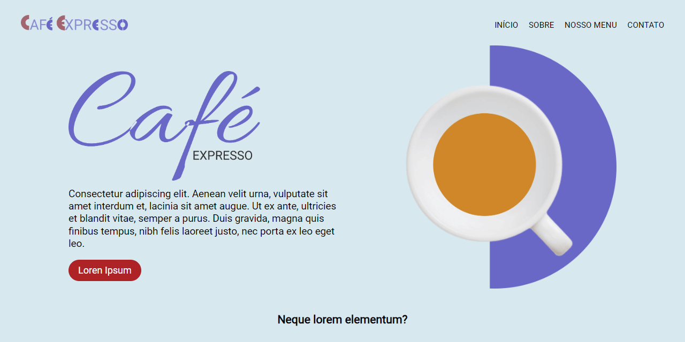
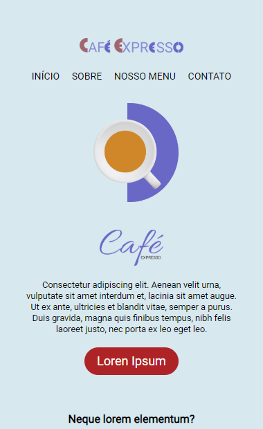

# **Café Expresso**

Acesse o Projeto: [Café Expresso React](https://cafe-expresso-site.vercel.app/)

## Sobre o projeto

O site Café Expresso foi construído com React JS utilizando Vite para agilizar o desenvolvimento. Ele emprega Hooks e TypeScript para uma codificação mais segura e eficiente. Além disso, apresenta um carrossel personalizado e utiliza CSS Modules e Flexbox para uma estilização modular e responsiva, integrando componentes de forma organizada em sua estrutura de arquivos e pastas.

O Café Expresso Site utiliza TypeScript e Hooks para uma codificação mais segura e eficiente.

#### About the project

The Café Expresso website was built with React JS using Vite to speed up development. It employs Hooks and TypeScript for safer and more efficient coding. Additionally, it features a custom carousel and uses CSS Modules and Flexbox for modular and responsive styling, integrating components neatly into your file and folder structure.

The Café Expresso Site uses TypeScript and Hooks for safer and more efficient coding.

## Mobile Layout

## Tecnologias Utilizadas (Technologies Used)
* HTML5
* CSS Module
* Flexbox
* JavaScript
* Typescript
* API JSON e Fetch
* React Js Vite

## Instalação (Installation)

##### Instalar Dependências (Install Dependencies)
<pre><code>npm install</code></pre>

##### Executar Aplicação (Run Application)
<pre><code>npm run dev</code></pre>

## Autor (Author)

#### **Katarine Albuquerque**

 &nbsp; 
